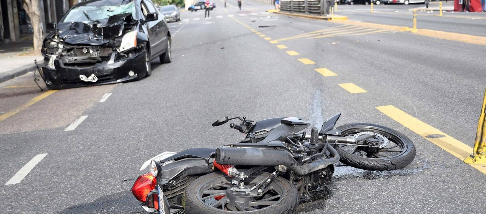
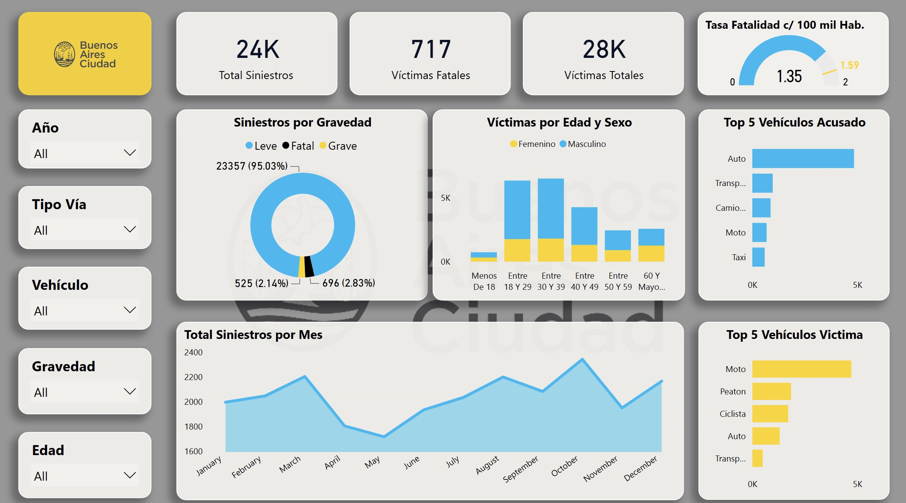

# Traffic Accidents Analysis in Buenos Aires

Para leer la versión en español, click [aquí](README.md)

**View the interactive PowerBI report [here](https://www.novypro.com/project/traffic-accidents-analysis-in-buenos-aires)**

## Description

The "Traffic Accidents Analysis" project is an initiative aimed at deeply exploring and analyzing traffic accidents in the city of Buenos Aires. Stemming from a mix of curiosity and the perception of the social relevance of road safety, this work aims to identify patterns, trends, and key factors related to traffic accidents. By delving into the data, the goal is not only to obtain statistical insights but also to contribute to the development of effective preventive strategies and measures.

## Objective

Through this study, we aim to:

- Understand the main causes of traffic accidents in Buenos Aires.
- Identify the most vulnerable groups.
- Discover patterns related to times and locations with the highest incidence of accidents.
- Offer recommendations based on the findings to improve road safety.

## Data Source

The data used in this project comes from the official [Buenos Aires City](https://www.buenosaires.gob.ar/datosabiertos) website. Here, you can also find a data dictionary detailing each variable.

## Tools and Technologies

For the development of this project, several tools and technologies were used:

- **Python**: Used for the ETL processes, data cleaning, and transformation.
- **Pandas and Numpy**: Essential libraries for data manipulation and analysis.
- **PowerBI**: The main tool for data visualization and the creation of interactive dashboards.
- **pandas-profiling**: Automated EDA, allowing for a quick and comprehensive initial exploration of the dataset.

## Exploratory Data Analysis (EDA)

Pandas-Profiling was used to perform automatic EDA. This tool provides a detailed report that includes descriptive statistics, distributions, and correlations, making the initial understanding of the data easier.

## ETL Process

The ETL (Extraction, Transformation, and Load) process was performed in Python. During this process, data was cleaned and transformed to be ready for analysis and visualization in Power BI.

## Data Modeling

Data modeling was carried out in Power BI using the model view. A star model was adopted, which has several advantages:

- **Performance**: With fewer relationships, queries tend to be faster.
- **Simplicity**: It's easier to understand and visualize.
- **Flexibility**: It facilitates the addition of new dimensions or facts without affecting existing ones.

## Dashboards and KPIs

I created a detailed report in Power BI composed of several pages, each focusing on a specific aspect of the analysis:

- **Overview**: This page provides a general view of the most relevant variables in the analysis. It serves as an introduction to the dataset, highlighting general trends and points of interest. It's the perfect starting point for those wanting to gain a quick and clear understanding of the data.
- **Geographic Distribution**: This dashboard focuses on analyzing the location of traffic accidents. It offers geospatial visualizations showing where accidents most frequently occur, allowing identification of problematic areas or high-risk zones on the map.
- **Temporal Evolution**: This page is dedicated to observing how traffic accidents have changed over time. Through trend charts, temporal patterns, spikes or declines in accident occurrences, and how these correlate with events or changes in traffic policies can be identified.
- **Focused KPIs**: This page is dedicated to three critical KPIs that reflect clear improvement objectives:
    - Fatal Accident Rate Reduction: The goal is to achieve a 10% reduction in the fatality rate in traffic accidents compared to the previous semester.
    - Reduction of Fatal Motorcycle Victims: A 7% reduction in the number of fatal motorcycle victims compared to the previous year is sought.
    - Reduction of Fatal Victims on Avenues: The goal is to reduce the number of fatal victims in accidents that occurred on avenues by 10% compared to the previous year.

## Insights

Some of the main findings include:

- The majority of accidents result in minor injuries.
- Men between the ages of 18 and 39 are the most affected by traffic accidents.
- Cars are the main culprits of accidents, but motorcyclists are the most frequent victims.
- The avenues are the zones with the highest number of accidents, both minor and fatal.

For a more detailed exploration of the findings, please refer to the interactive PowerBI report linked above.

## Recommendations

Based on the findings, several recommendations can be made to improve road safety in Buenos Aires:

- Implement awareness campaigns targeted specifically at young men.
- Develop road safety education programs and protective measures for motorcyclists.
- Enhance signage and control on avenues to reduce the number and severity of accidents.
- Increase surveillance and controls between 6 and 7 am, a critical period for fatal victims.

## Feedback and Collaboration

Feedback and suggestions are always welcome. If you have any insights or would like to collaborate on related projects, feel free to connect with me on [LinkedIn](https://www.linkedin.com/in/kimberly-negrette/).

