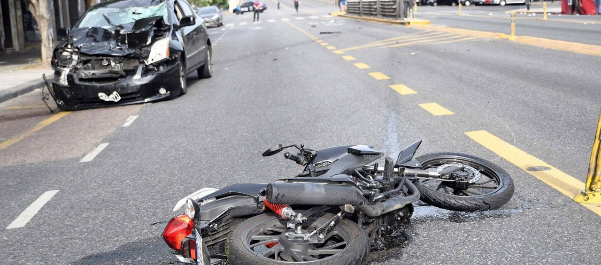
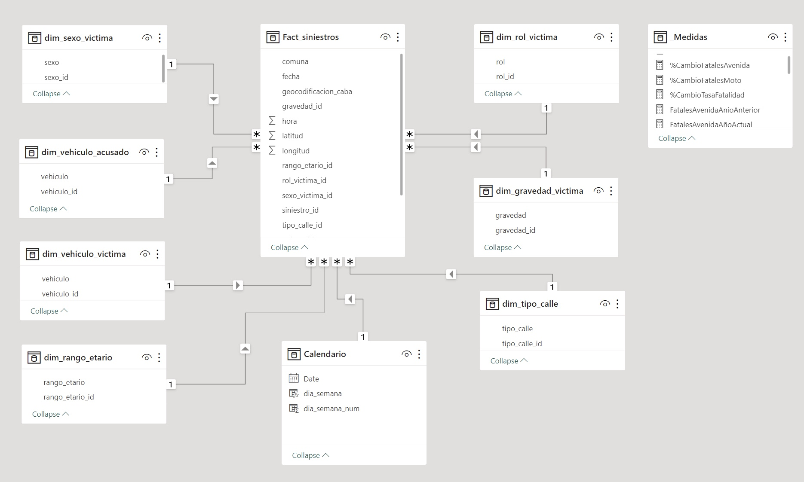
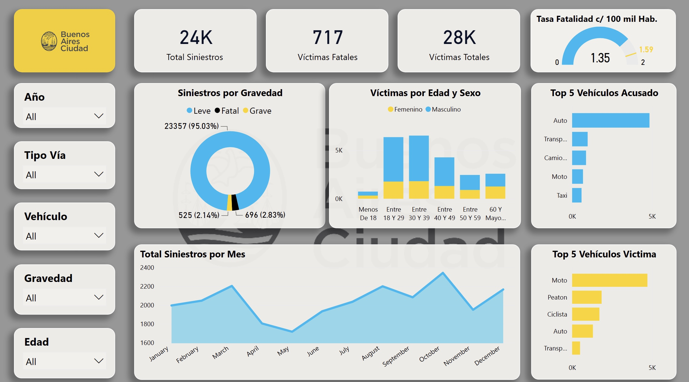
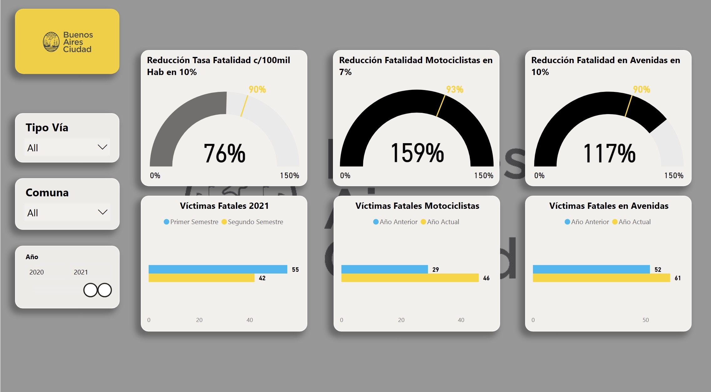

# Análisis de Siniestros Viales en Buenos Aires

**Visualiza el reporte interactivo de PowerBI [aquí]()**

## Descripción

El proyecto "Análisis de Siniestros Viales" es una iniciativa orientada a explorar y analizar en profundidad los siniestros viales de la ciudad de Buenos Aires. Surgiendo de una combinación de curiosidad y la percepción de la relevancia social de la seguridad vial, este trabajo busca identificar patrones, tendencias y factores clave relacionados con los accidentes de tráfico. Al profundizar en los datos, no solo se persigue el objetivo de adquirir conocimientos y habilidades analíticas, sino también de contribuir a la conciencia y prevención en torno a esta problemática.

La naturaleza multidimensional de los siniestros viales requiere un enfoque meticuloso y un análisis cuidadoso. Por ello, se ha adoptado una variedad de herramientas y técnicas, desde el proceso de ETL realizado en Python hasta la visualización y modelado de datos en Power BI. Además de los análisis centrales, se han incorporado KPIs y se ha llevado a cabo un análisis exploratorio con Pandas-Profiling para obtener una visión holística de la situación.

El resultado es un reporte compuesto por un conjunto coherente de dashboards y análisis que no solo destaca las métricas y tendencias clave, sino que también subraya las áreas de intervención potencial para mejorar la seguridad vial y disminuir la tasa de fatalidad en siniestros. A través de este proyecto, espero no solo ilustrar la utilidad del análisis de datos en contextos prácticos, sino también resaltar la importancia de la seguridad vial como una cuestión que nos afecta a todos.

## Herramientas Utilizadas

- **Pandas-Profiling**: Ayudó en la realización de un análisis exploratorio de datos (EDA) automático.
- **Python**: Utilizado para el proceso de ETL, transformando y preparando los datos para su análisis.
- **Power BI**: Se utilizó para visualizar los datos y construir dashboards interactivos.

## Análisis Exploratorio de Datos (EDA)

Se utilizó Pandas-Profiling para realizar un EDA automático. Esta herramienta proporciona un informe detallado que incluye estadísticas descriptivas, distribuciones y correlaciones, lo que facilita la comprensión inicial de los datos.

## Proceso de ETL

El proceso ETL (Extracción, Transformación y Carga) se realizó en Python. Durante este proceso, se limpiaron y transformaron los datos para que estuvieran listos para su análisis y visualización en Power BI. Esto incluyó:

## Modelado de Datos

El modelado de datos se realizó en Power BI usando la vista de modelo. Se adoptó un modelo estrella, que tiene varias ventajas:

- **Rendimiento**: Al tener menos relaciones, las consultas suelen ser más rápidas.
- **Simplicidad**: Es más fácil de entender y visualizar.
- **Flexibilidad**: Facilita la adición de nuevas dimensiones o hechos sin afectar las existentes.

## Dashboards y KPIs

Realicé un reporte detallado en Power BI compuesto por varias páginas, cada una centrada en un aspecto específico del análisis:

- **Overview**: Esta página proporciona una visión general de las variables más relevantes del análisis. Sirve como introducción al conjunto de datos, destacando las tendencias generales y los puntos de interés. Es el punto de partida perfecto para aquellos que desean obtener una comprensión rápida y clara de los datos.
- **Distribución Geográfica**: Este dashboard se centra en analizar la ubicación de los siniestros viales. Ofrece visualizaciones geoespaciales que muestran dónde ocurren con mayor frecuencia los accidentes, permitiendo identificar áreas problemáticas o zonas de alto riesgo en la geografía.
- **Evolución Temporal**: Esta página se dedica a observar cómo han cambiado los siniestros viales con el tiempo. A través de gráficos de tendencia, se pueden identificar patrones temporales, picos o declives en la ocurrencia de accidentes y cómo estos se correlacionan con eventos o cambios en políticas de tránsito.
- **KPIs Focalizados**: Esta página se dedica a tres KPIs críticos que reflejan objetivos claros de mejora:
        - Reducción de la Tasa de Fatalidad: El objetivo es lograr una reducción del 10% en la tasa de fatalidad en siniestros viales en comparación con el semestre anterior.
        -Reducción de Víctimas Fatales Motociclistas: Se busca una reducción del 7% en el número de víctimas fatales motociclistas en comparación con el año anterior.
        - Reducción de Víctimas Fatales en Avenidas: El objetivo es reducir en un 10% el número de víctimas fatales en accidentes ocurridos en avenidas, comparado con el año anterior. 

## Insights

1. **Gravedad de las Víctimas**: 
    - La vasta mayoría de siniestros en Buenos Aires resultan en heridas leves, con un 95% de los casos.
    
2. **Perfil de las Víctimas**: 
    - Los hombres entre 18 y 39 años son los más afectados por siniestros viales.

3. **Vehículos Involucrados**: 
    - Los autos son los principales causantes de accidentes.    
    - Sin embargo, motociclistas y peatones, especialmente los primeros, son las víctimas más frecuentes.

4. **Temporalidad**:
   - A lo largo de los años, marzo, octubre y diciembre registran el mayor número de siniestros.
   - Desde 2016, hubo una reducción significativa en víctimas fatales, siendo particularmente notable en 2020 debido a la pandemia.
   - Los viernes son los días más propensos a accidentes.
   - Aunque hay un pico de accidentes entre las 13 y 17 horas, es entre las 6 y 7 am donde se registran más víctimas fatales.

5. **Análisis Geográfico**:
   - Las avenidas son las zonas con más siniestros, tanto leves como fatales.
   - Las comunas 1, 15 y 4 tienen el mayor número de víctimas, con una propensión particularmente alta hacia las víctimas fatales.

## Recomendaciones

1. **Focalización en Grupos de Riesgo**: 
    - Implementar campañas de concientización dirigidas específicamente a hombres jóvenes.

2. **Estrategias para Motociclistas**: 
    - Desarrollar programas de educación vial y medidas de protección para motociclistas.

3. **Medidas en Avenidas**: 
    - Reforzar la señalización y control en las avenidas para reducir la cantidad y gravedad de los siniestros.

4. **Horas Críticas**: 
    - Incrementar la vigilancia y controles entre las 6 y 7 am, período crítico de víctimas fatales.

## Conclusiones

- Se logró una significativa reducción en la tasa de fatalidad por cada 100,000 habitantes en el último semestre de 2021, superando el objetivo del KPI con una disminución del 24%.
- A pesar de los esfuerzos, el número de víctimas fatales motociclistas y en avenidas aumentó en 2021, no cumpliendo con los objetivos establecidos. Es crucial revisar y reforzar las estrategias en estas áreas.
- Este proyecto proporciona una visión detallada de los siniestros viales, utilizando diversas herramientas y técnicas de análisis de datos. Los insights derivados de este análisis son valiosos para la toma de decisiones y la formulación de políticas relacionadas con la seguridad vial.

## Recursos y Contacto

- **Reporte Interactivo**: Puedes explorar el reporte de manera interactiva y detallada en [Novypro](<enlace_novypro_aquí>).

- **Datos Originales**: Los datos utilizados para este proyecto provienen de la página oficial de [Buenos Aires Ciudad](https://data.buenosaires.gob.ar/dataset/victimas-siniestros-viales). Allí también encontrarás un diccionario de datos que explica cada variable en detalle.

- **Feedback y Colaboraciones**: Si tienes comentarios, sugerencias o estás interesado en colaborar en proyectos relacionados, te invito a conectarte conmigo a través de [LinkedIn](https://www.linkedin.com/in/kimberly-negrette/).
